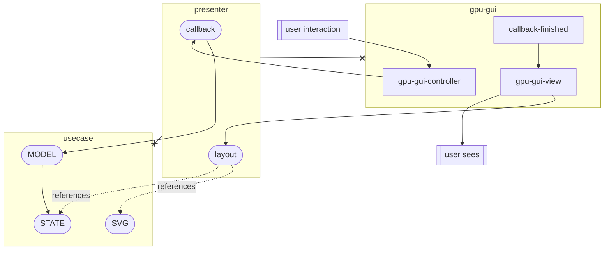

# gpu-gui

Using gpu to generate dynamic vector graphics for GUI purpose

# Design Goals

Low-level with maximum convenience and minimum ownership.

### Vector Graphics as View

Typically, vector graphics designed on figma cannot be used directly as a GUI.
Often, a developer re-implements the design in languages like HTML so the interface can take interactions like click and text input.

This two step process can be reduced if the View of MVC was strictly focused on showing and had no focus on interactions.
In such MVC, the View could be a .svg file.
Combined with gpu-gui program which adds dynamic programmability to svg files, features like click, text input, and responsiveness would be available.

### Algorithmic Layout

Layout requires no additional knowledge other than some basic math concepts.

This is in contrast to methods like CSS where arbitrary concepts `flexbox` or `block` is crucial.
CSS requires studying these concepts, rather than exposing the math behind it.
If concepts like `flexbox` and `block` are convenient, it should be provided similar to `std` libraries, just as a convenience abstraction.
There'd be the benefit of allowing competitions among convenience abstractions, which would make inconvenient abstractions obsolete earlier than if it was provided as primary methods like CSS does.

### NICE TO HAVE: DDT (Design Driven Tests)

Designs created on figma can be considered a test case for a specific state.

### NICE TO HAVE: Codegen

Generate code from SVG

- ID list
- Directives: @Clickable, @Component, @State, @NoScroll, etc...

# Architecture

# Test Cases

### Minimum

- Center a rectangle
- Resize a rounded rectangle
- Checkbox

### Full

- GPU-GUI-VIEW

  1. Center a rectangle
  1. Resize a rounded rectangle

- GPU-GUI-CONTROLLER

  1. Checkbox
  1. Show Array
  1. Modify array
  1. Reorder array

- Text

  1. Resize a text field with word break
  1. Write text
  1. Delete multi-line text
  1. Copy/Paste

- Scroll

  1. Scroll

- Media

  - PNG

# TODO

- [ ] GPU renderer
- [ ] Minimal Test
- [ ] State diff interceptor
- [ ] SVG code-gen Rust

# Why Gpu

GPU vs CPU comparison with WASM:https://www.reddit.com/r/rust/comments/tm10wi/media_i_made_a_website_to_demonstrate_performance/
MakePad runs GUI on shader with great performance: https://makepad.dev/

# Random Resources

- Rust Web 2D perf Reddit: https://www.reddit.com/r/rust/comments/ni0wgs/2d_web_rendering_with_rust/
- Web SVG performance: https://oreillymedia.github.io/Using_SVG/extras/ch19-performance.html
- GPU vector rendering: https://developer.nvidia.com/gpugems/gpugems3/part-iv-image-effects/chapter-25-rendering-vector-art-gpu
- Rust api guidelines: https://rust-lang.github.io/api-guidelines/about.html
- rust-analyzer guidelines: https://github.com/rust-analyzer/rust-analyzer/blob/master/docs/dev/style.md#getters--setters
